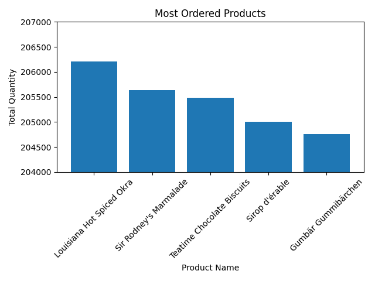
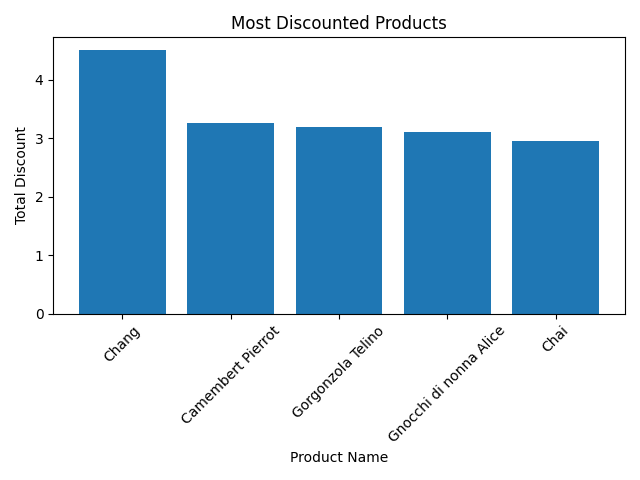

# SQL + Python: Business Sales Analysis (Microsoft Northwind Database)

This project demonstrates how to combine **SQL** and **Python** to analyze business sales data from the classic **Northwind database**.

---

## Process

1. Read the relevant tables related to **products** and **orders**.  
2. Identify the **most ordered and most discounted products**.  
3. Visualize the **top 5 ordered and discounted products** using bar charts.  

---

## Results

### Top 5 Most Ordered Products


### Top 5 Most Discounted Products


---
## Prerequisite Libraries

To run the code, make sure you have the following libraries installed:

```bash
pip install pandas matplotlib seaborn sqlite3
